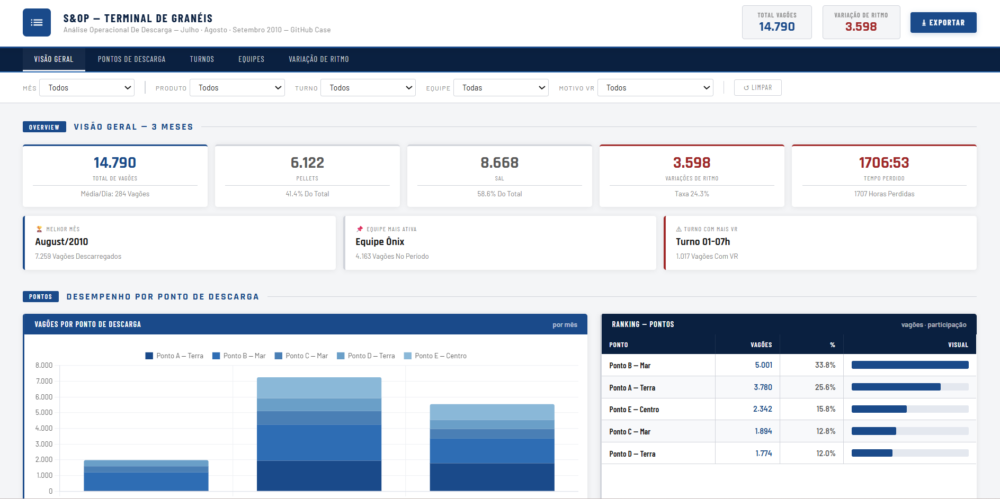

# Terminal Granel S&OP

Dashboard executivo e automação em Python para análise de descarga de granéis, com foco em S&OP, produtividade por ponto operacional, performance de turnos/equipes e leitura das perdas por variação de ritmo.

## Acesse o Dashboard

[Clique aqui para navegar no dashboard interativo](https://fabricionettto-commits.github.io/Terminal_Granel_S-OP/)



## Visão de Operações

Este projeto transforma uma base operacional de descarga ferroviária em um painel de tomada de decisão. A proposta é sair da planilha bruta e chegar em uma visão clara de capacidade, gargalo, utilização e causas de perda, com leitura rápida para planejamento, supervisão e rotina de performance.

O dashboard foi pensado para responder perguntas típicas de uma operação real:

- Qual ponto de descarga está concentrando maior volume?
- Qual turno entrega mais vagões e onde há perda de ritmo?
- Qual equipe apresenta melhor desempenho operacional?
- Quais produtos impactam mais a ocupação da estrutura?
- Quais motivos de variação de ritmo merecem plano de ação?
- Onde o planejamento precisa atuar para proteger capacidade e nível de serviço?

## O Que Foi Construído

- `index.html`: dashboard final, pronto para visualização no navegador.
- `Terminal_Granel_S&OP.py`: automação Python que lê, limpa, normaliza, agrega e injeta os dados no HTML.
- `Terminal_Granel.csv`: base operacional utilizada no estudo.
- `index.html.png`: imagem de apresentação do painel para o GitHub.

## Indicadores Trabalhados

| Dimensão | Leitura operacional |
| --- | --- |
| Volume | Total de vagões descarregados e média diária |
| Ponto de descarga | Comparativo entre moegas/pontos operacionais |
| Turno | Distribuição por janelas de trabalho |
| Equipe | Performance por equipe operacional |
| Produto | Separação entre fluxos de produto |
| Variação de ritmo | Motivos de perda, frequência e tempo associado |
| Planejamento | Base para priorização de ações e gestão de capacidade |

## Base Analisada

- 15.016 registros operacionais
- 14.790 registros com data válida
- Período analisado: 31/07/2023 a 20/09/2023
- 5 pontos de descarga
- 5 equipes operacionais
- 4 turnos de operação
- 2 famílias principais de produto: `MILHO` e `VHP`
- 3.598 ocorrências classificadas com variação de ritmo

## Inteligência Operacional Aplicada

O projeto não é apenas visualização. A automação organiza a base para transformar evento operacional em informação gerencial:

- padronização de equipes, produtos, turnos e pontos de descarga;
- tratamento de datas e duração de eventos;
- cálculo de volume por mês, ponto, turno, equipe e produto;
- separação das ocorrências normais e eventos com variação de ritmo;
- leitura de perdas por motivo, equipe e turno;
- geração de payload estruturado para filtros dinâmicos no dashboard;
- exportação de um HTML final que funciona como relatório navegável.

## Stack Técnica

- Python
- Pandas
- NumPy
- HTML
- CSS
- JavaScript
- Chart.js

## Como Executar

1. Instale as dependências principais:

```bash
pip install pandas numpy
```

2. Ajuste o caminho do arquivo `CSV_PATH` em `Terminal_Granel_S&OP.py`, se necessário.

3. Execute a automação:

```bash
python "Terminal_Granel_S&OP.py"
```

4. Abra o arquivo HTML gerado no navegador.

O arquivo `index.html` já está publicado como versão pronta do dashboard.

## Por Que Esse Projeto Importa

Em operação portuária, terminal de granéis e descarga ferroviária, o problema raramente é falta de dado. O desafio é transformar apontamentos de campo em leitura de decisão.

Este case mostra domínio de três frentes ao mesmo tempo:

- operação: entendimento de turno, equipe, ponto de descarga, produto, restrição e perda de ritmo;
- planejamento: visão de capacidade, gargalo, volume, priorização e rotina de performance;
- automação: uso de Python para tratar dados, criar indicadores e entregar um dashboard pronto para análise.

É um projeto com cara de chão de operação, mas estruturado com mentalidade de S&OP: medir, comparar, priorizar e agir.
